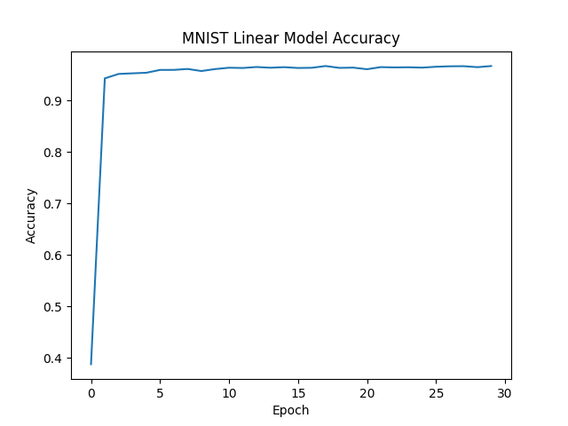

# MNIST

The MNIST database is a large database of handwritten digits that is often used to introduce aspiring data scientists and machine learning enthusists to the world of neural networks. As such, it is also a great place to start showing off the power and versatility that the CML library offers.

To start, first you must download the dataset from the official website. This can be done using the following script:

```bash
mkdir -p data
wget http://yann.lecun.com/exdb/mnist/train-images-idx3-ubyte.gz -q -o /dev/null -P data/ &
wget http://yann.lecun.com/exdb/mnist/train-labels-idx1-ubyte.gz -q -o /dev/null -P data/ &
wget http://yann.lecun.com/exdb/mnist/t10k-images-idx3-ubyte.gz -q -o /dev/null -P data/ &
wget http://yann.lecun.com/exdb/mnist/t10k-labels-idx1-ubyte.gz -q -o /dev/null -P data/ &
wait

gunzip data/train-images-idx3-ubyte.gz &
gunzip data/train-labels-idx1-ubyte.gz &
gunzip data/t10k-images-idx3-ubyte.gz &
gunzip data/t10k-labels-idx1-ubyte.gz &
wait
```

Now that you have the dataset downloaded and prepared to go, you must compile the mnist example to run anything.

```bash
make
./mnist
```

Running the above, you will see the verbose style output. The accuracies can be summed up as:



Evidently, it does very well.
